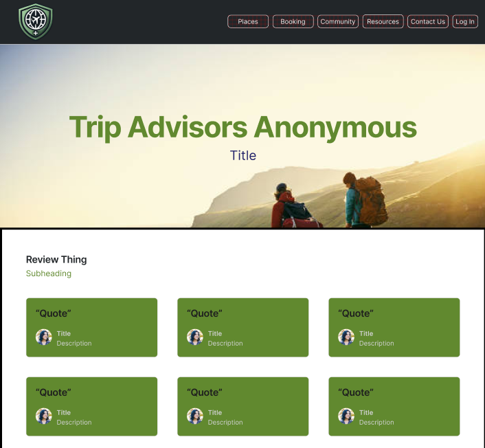
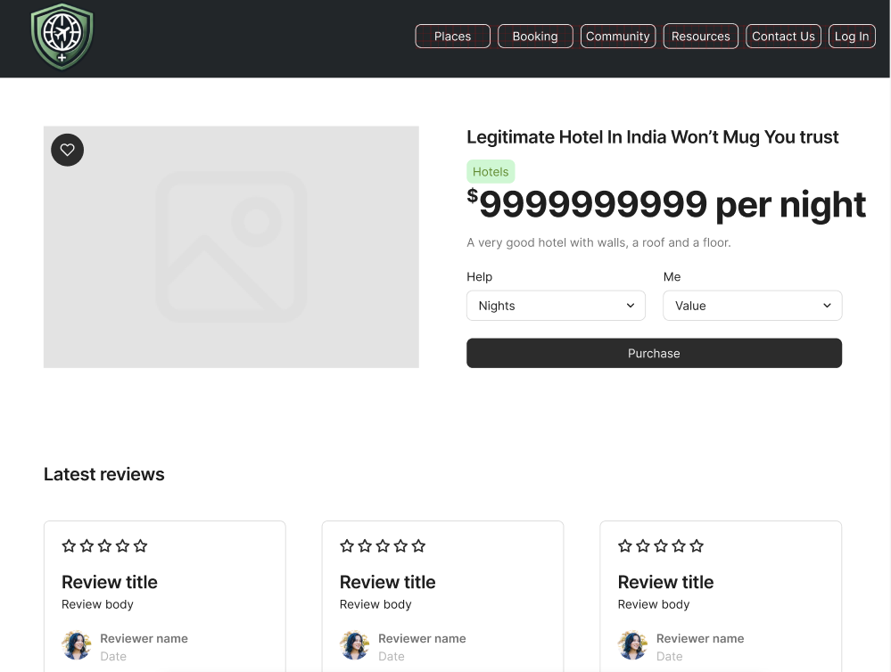
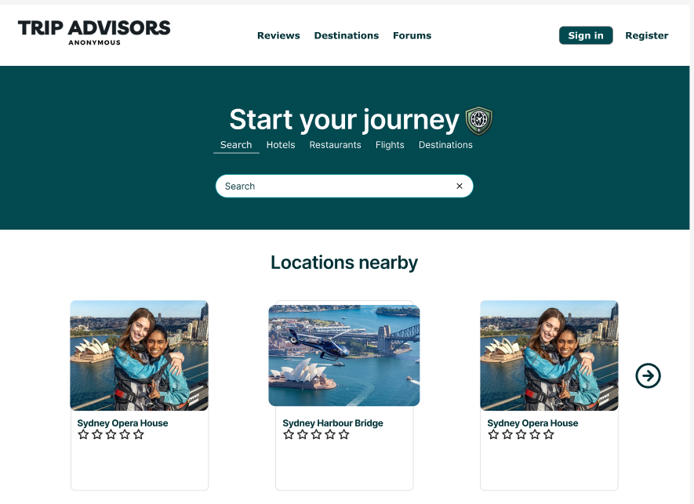
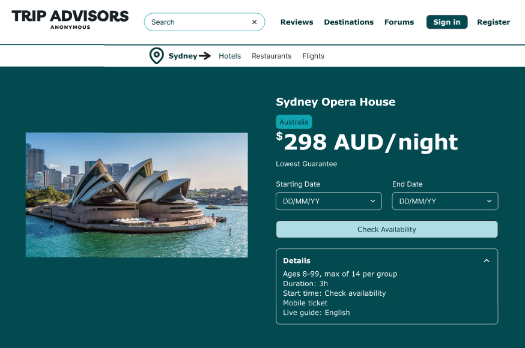
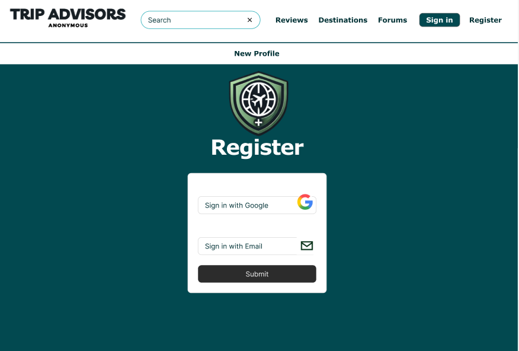
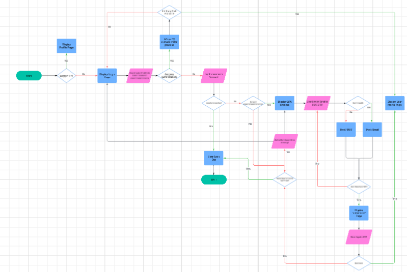

# Week 1: Project Definition and Requirements

The goal of this project is to create a functioning web application for a client. Through ensuring that both frontend and backend are able to function and communicate well, and making sure that all functional and non functional requirements have been completed. This web application is created for the goal of aiding travelers in planning and booking travels, as well as providing a platform for users to share advice, travel experinces and reviews. If possible, the website will also provide anonymity.

# Functional and Non-Functional Requirements

| Functional      | Non Functional |
| :---:        |    :----:   |
| User should be able to log in with username and password | Multiple web pages that are easy to transition between |
| User should be able to post, comment and view public content and media | System should be able to process large amounts of users at the same time |
| User should be able to book, review and plan travel | Profiles should be secure and anonymoux s |
| User should be able to pay online for services |  User interface must be easy to use for new users |

# App Design

Very first draft Homepage design.

Initial draft example location/reviews design.

| Design Element      | Choice |
| :---:        |    :----:   |
| Typography | Inter Font Used |
| Colour Palete | Used Hex Code Colours #61892F #222629, similar to those found in logo |
| Image/Icon Choice | Used Colours similar to the ones in the logo for images #61892F #222629 |

# Alternative App Design
Alternative Homepage design.

Alternative example location/reviews design.

Alternative login page design.

| Design Element Changes    | Choice |
| :---:        |    :----:   |
| Typography | Verdana Font Used Instead |
| Colour Palete | Used Instead #024950 #fffff, primarily |
| Image/Icon Choice | Used Colours more suited to the new Palete|
| Misc | Search Bar added to front page, different naviation layout along with product page layout|

# Algorithim Design

## Flowchart:

## Test Case 1:

**Test Case ID:** TC001

**Test Case Name:** Verifying Username, Password and 2FA

**Preconditions:** User must have a verfied account, and a setup email/SMS, User must not already be logged in or locked out

**Test Steps:** 
  1: Open the Application
  2: Head to Login Page
  3: Select Username/Password
  4: Enter valid username/password
  5: Enter OTP
  6: Click "Login"

**Expected Result:** User is directed to Profile Page

**Priority:** High

## Test Case 2:

**Test Case ID:** TC002

**Test Case Name:** User attempts to leave a review

**Preconditions:** User must have a verfied account, be signed in, and possess the ability to type

**Test Steps:** 
  1: Open Review Page of location/hotel/other product
  2: Inputs string of text
  3: User clicks send
  4: Username and review are made public
  5: The system updates to process the review
  6: Any changes to average rating, number of reviews, etc. are noted

**Expected Result:** User's review is now public and their review has affected the product's rating

**Priority:** High

# Setting up development environment

## Competed Steps:
- 

# App Design

TODO (10/10):
- Limit number of listings on main page
- Listings by type
- Profile Page
- Fix Date
- Integrate Rego
- Business Profile add listings
- (Maybe) Search Bar for Listing
- Edit own reviews

- Final Checklistd

Issue with service worker:
Because it was loading from /stat/js, service worker would only run for everything under static/js, so defined within main.pyy, a route that loaded it from /, increasing scope.

(10/25)
- 

Likes Fuctioning:
- Required ajax
- Ascynchronus cal returing json rather than a page, updating only one thgin rather than refreshing
- Addition and subtracting logic, updating likes coun & user liked

Search Function
- Updating Querey adding a where clause

Register
- Check for duplicates
- Flashing for any messages, qued up until shown, however, it didn't matter, shows messages to user from app 

Login
- Password Hashing teset whrer youinserted date wo a pasword  "JOhn", when registered now hash

# Testing Instructions (Hi Mr Clark)
Download code, load into VSCode and within the Flask_PWA_Template directory, run main.py 

Testing Username: MrClark
Testing Password: MrClark

